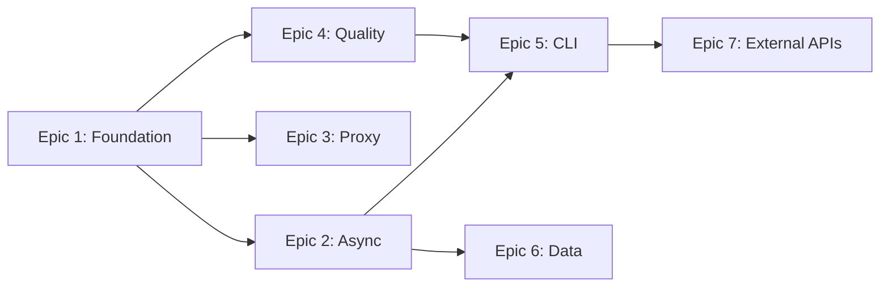

# Epics & Stories — Mr.Holmes Modernization

## Epic List

### Epic 1: Foundation Refactoring — Code Structure Cleanup
**Mục tiêu:** Developer có thể đọc, sửa, và mở rộng codebase một cách an toàn nhờ kiến trúc modular, method signatures rõ ràng, và zero code duplication.

**FRs covered:** FR18 (input validation)
**NFRs covered:** NFR7 (structured errors)

**Stories:**
1. **Story 1.1:** Tạo `ScanContext` và `ScanResult` dataclasses thay thế 19-param method signature
2. **Story 1.2:** Extract `_process_tags()` method — loại bỏ 60 LOC duplication trong `Requests_Search.py`
3. **Story 1.3:** Tách `MrHolmes.search()` God Method (500 LOC) → `ScanPipeline` class với các method riêng biệt
4. **Story 1.4:** Tạo `ScraperRegistry` — thay 250 LOC copy-paste dispatch bằng registry dict + generic dispatcher
5. **Story 1.5:** Extract `ProxyManager` class — gom proxy resolution code lặp 3 lần
6. **Story 1.6:** Fix file I/O → context managers (`with open()`)
7. **Story 1.7:** Input validation — sanitize username (path traversal), validate integer inputs

---

### Epic 2: Async Scanning Engine — Performance Breakthrough
**Mục tiêu:** User có thể quét hàng trăm sites trong < 2 phút thay vì 15-25 phút nhờ concurrent HTTP requests.

**FRs covered:** FR1, FR2, FR3, FR4, FR5
**NFRs covered:** NFR1 (performance), NFR5 (Python 3.9+)

**Stories:**
1. **Story 2.1:** Migrate `Requests_Search.py` từ `requests.get()` → `aiohttp.ClientSession` async method
2. **Story 2.2:** Implement `asyncio.gather()` + `asyncio.Semaphore(N)` trong `ScanPipeline`
3. **Story 2.3:** Implement `ScanResult[]` collection pattern — thu thập concurrent, xử lý tập trung
4. **Story 2.4:** Tạo custom exception classes (`TargetSiteTimeout`, `ProxyDeadError`, `RateLimitExceeded`)
5. **Story 2.5:** Implement exponential backoff + jitter cho retry logic
6. **Story 2.6:** Update `requirements.txt` với `aiohttp`, `aiofiles`

---

### Epic 3: Smart Proxy System
**Mục tiêu:** User có thể quét ổn định với proxy tự động rotate, health-check, và CAPTCHA detection.

**FRs covered:** FR6, FR7, FR8
**NFRs covered:** NFR1 (reliability)

**Stories:**
1. **Story 3.1:** Implement auto-rotate proxy trong `ProxyManager` khi proxy chết
2. **Story 3.2:** Implement proxy health-check trước mỗi session
3. **Story 3.3:** Phát hiện CAPTCHA/block qua response codes (403, 429) và HTML content

---

### Epic 4: Quality & Security Hardening
**Mục tiêu:** Developer có thể tự tin refactor nhờ test coverage, và user data được bảo vệ nhờ secrets management.

**FRs covered:** FR19, FR20, FR21
**NFRs covered:** NFR3 (60% coverage), NFR6 (zero plaintext secrets), NFR7 (structured errors)

**Stories:**
1. **Story 4.1:** Setup `pytest` + `aioresponses` framework, viết test cho 3 error strategies
2. **Story 4.2:** Migrate `Configuration.ini` secrets → `.env` + `python-dotenv`, tạo `.env.example`
3. **Story 4.3:** Thay thế `print()` → Python `logging` module với configurable levels
4. **Story 4.4:** Loại bỏ tất cả `except Exception: pass` → structured error handling
5. **Story 4.5:** Setup GitHub Actions CI — auto-run tests on PR

---

### Epic 5: CLI Modernization & Batch Mode
**Mục tiêu:** User có thể chạy Mr.Holmes non-interactive (automation) và có giao diện terminal chuyên nghiệp.

**FRs covered:** FR16, FR17, FR18
**NFRs covered:** NFR5 (Python 3.9+)

**Stories:**
1. **Story 5.1:** Implement `argparse` CLI interface — `--username`, `--proxy`, `--nsfw`, `--output`
2. **Story 5.2:** Abstract output layer — tách presentation logic khỏi business logic
3. **Story 5.3:** Tích hợp `Rich` library — progress bars, tables, tree layout

---

### Epic 6: Data Persistence & Export
**Mục tiêu:** User có thể lưu trữ, tìm kiếm cross-case, và export báo cáo ra PDF/CSV.

**FRs covered:** FR12, FR13, FR14, FR15
**NFRs covered:** NFR4 (backward compatible dual-write)

**Stories:**
1. **Story 6.1:** Design SQLite schema cho OSINT findings (normalized)
2. **Story 6.2:** Implement dual-write — `ReportWriter` ghi cả file lẫn SQLite
3. **Story 6.3:** Migrate PHP GUI đọc từ SQLite
4. **Story 6.4:** Implement PDF export via Jinja2 templates
5. **Story 6.5:** Implement CSV export

---

### Epic 7: External Intelligence APIs
**Mục tiêu:** User có thể mở rộng OSINT coverage qua HaveIBeenPwned và Shodan integrations.

**FRs covered:** FR22, FR23, FR24

**Stories:**
1. **Story 7.1:** Tạo Plugin Interface chuẩn cho external APIs
2. **Story 7.2:** Implement HaveIBeenPwned integration (email breach check)
3. **Story 7.3:** Implement Shodan integration (IP/port intelligence)
4. **Story 7.4:** Config UI cho API key management
5. **Story 7.5:** Tích hợp Leak-Lookup API làm DB rò rỉ (Fallback HIBP)
6. **Story 7.6:** Tích hợp metasearch SearxNG để cào OSINT Dorks chống Captcha

---

## FR Coverage Map

| FR | Epic | Mô tả |
|----|------|-------|
| FR1 | Epic 2 | Concurrent scanning |
| FR2 | Epic 2 | Semaphore limit |
| FR3 | Epic 2 | Ordered results |
| FR4 | Epic 2 | Rate limit detection |
| FR5 | Epic 2 | Exponential backoff |
| FR6 | Epic 3 | Auto-rotate proxy |
| FR7 | Epic 3 | Proxy health-check |
| FR8 | Epic 3 | Configurable proxy sources |
| FR9 | Epic 1 | Scraper registry |
| FR10 | Epic 1 | Concurrent scraper dispatch |
| FR11 | Epic 1 | Scraper retry fallback |
| FR12 | Epic 6 | Dual-write (file + DB) |
| FR13 | Epic 6 | PDF/CSV/JSON export |
| FR14 | Epic 6 | Cross-case search |
| FR15 | Epic 6 | PHP GUI reads SQLite |
| FR16 | Epic 5 | Batch mode CLI |
| FR17 | Epic 5 | Rich terminal UI |
| FR18 | Epic 1, 5 | Input validation |
| FR19 | Epic 4 | Secrets management |
| FR20 | Epic 4 | Structured logging |
| FR21 | Epic 4 | Unit tests |
| FR22 | Epic 7 | HaveIBeenPwned |
| FR23 | Epic 7 | Shodan integration |
| FR24 | Epic 7 | API key config |

## Dependencies

> **Lưu ý:** Epic 1 là tiên quyết. Epic 4 nên chạy song song với Epic 1-2 để có safety net.
