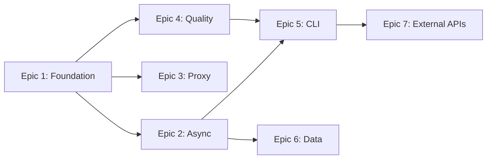

# Epics & Stories — Mr.Holmes Modernization

## Epic List

### Epic 1: Foundation Refactoring — Code Structure Cleanup
**Mục tiêu:** Developer có thể đọc, sửa, và mở rộng codebase một cách an toàn nhờ kiến trúc modular, method signatures rõ ràng, và zero code duplication.

**FRs covered:** FR18 (input validation)
**NFRs covered:** NFR7 (structured errors)

**Stories:**
1. **Story 1.1:** Tạo `ScanContext` và `ScanResult` dataclasses thay thế 19-param method signature
2. **Story 1.2:** Extract `_process_tags()` method — loại bỏ 60 LOC duplication trong `Requests_Search.py`
3. **Story 1.3:** Tách `MrHolmes.search()` God Method (500 LOC) → `ScanPipeline` class với các method riêng biệt
4. **Story 1.4:** Tạo `ScraperRegistry` — thay 250 LOC copy-paste dispatch bằng registry dict + generic dispatcher
5. **Story 1.5:** Extract `ProxyManager` class — gom proxy resolution code lặp 3 lần
6. **Story 1.6:** Fix file I/O → context managers (`with open()`)
7. **Story 1.7:** Input validation — sanitize username (path traversal), validate integer inputs

---

### Epic 2: Async Scanning Engine — Performance Breakthrough
**Mục tiêu:** User có thể quét hàng trăm sites trong < 2 phút thay vì 15-25 phút nhờ concurrent HTTP requests.

**FRs covered:** FR1, FR2, FR3, FR4, FR5
**NFRs covered:** NFR1 (performance), NFR5 (Python 3.9+)

**Stories:**
1. **Story 2.1:** Migrate `Requests_Search.py` từ `requests.get()` → `aiohttp.ClientSession` async method
2. **Story 2.2:** Implement `asyncio.gather()` + `asyncio.Semaphore(N)` trong `ScanPipeline`
3. **Story 2.3:** Implement `ScanResult[]` collection pattern — thu thập concurrent, xử lý tập trung
4. **Story 2.4:** Tạo custom exception classes (`TargetSiteTimeout`, `ProxyDeadError`, `RateLimitExceeded`)
5. **Story 2.5:** Implement exponential backoff + jitter cho retry logic
6. **Story 2.6:** Update `requirements.txt` với `aiohttp`, `aiofiles`

---

### Epic 3: Smart Proxy System
**Mục tiêu:** User có thể quét ổn định với proxy tự động rotate, health-check, và CAPTCHA detection.

**FRs covered:** FR6, FR7, FR8
**NFRs covered:** NFR1 (reliability)

**Stories:**
1. **Story 3.1:** Implement auto-rotate proxy trong `ProxyManager` khi proxy chết
2. **Story 3.2:** Implement proxy health-check trước mỗi session
3. **Story 3.3:** Phát hiện CAPTCHA/block qua response codes (403, 429) và HTML content

---

### Epic 4: Quality & Security Hardening
**Mục tiêu:** Developer có thể tự tin refactor nhờ test coverage, và user data được bảo vệ nhờ secrets management.

**FRs covered:** FR19, FR20, FR21
**NFRs covered:** NFR3 (60% coverage), NFR6 (zero plaintext secrets), NFR7 (structured errors)

**Stories:**
1. **Story 4.1:** Setup `pytest` + `aioresponses` framework, viết test cho 3 error strategies
2. **Story 4.2:** Migrate `Configuration.ini` secrets → `.env` + `python-dotenv`, tạo `.env.example`
3. **Story 4.3:** Thay thế `print()` → Python `logging` module với configurable levels
4. **Story 4.4:** Loại bỏ tất cả `except Exception: pass` → structured error handling
5. **Story 4.5:** Setup GitHub Actions CI — auto-run tests on PR

---

### Epic 5: CLI Modernization & Batch Mode
**Mục tiêu:** User có thể chạy Mr.Holmes non-interactive (automation) và có giao diện terminal chuyên nghiệp.

**FRs covered:** FR16, FR17, FR18
**NFRs covered:** NFR5 (Python 3.9+)

**Stories:**
1. **Story 5.1:** Implement `argparse` CLI interface — `--username`, `--proxy`, `--nsfw`, `--output`
2. **Story 5.2:** Abstract output layer — tách presentation logic khỏi business logic
3. **Story 5.3:** Tích hợp `Rich` library — progress bars, tables, tree layout

---

### Epic 6: Data Persistence & Export
**Mục tiêu:** User có thể lưu trữ, tìm kiếm cross-case, và export báo cáo ra PDF/CSV.

**FRs covered:** FR12, FR13, FR14, FR15
**NFRs covered:** NFR4 (backward compatible dual-write)

**Stories:**
1. **Story 6.1:** Design SQLite schema cho OSINT findings (normalized)
2. **Story 6.2:** Implement dual-write — `ReportWriter` ghi cả file lẫn SQLite
3. **Story 6.3:** Migrate PHP GUI đọc từ SQLite
4. **Story 6.4:** Implement PDF export via Jinja2 templates
5. **Story 6.5:** Implement CSV export

---

### Epic 7: External Intelligence APIs
**Mục tiêu:** User có thể mở rộng OSINT coverage qua HaveIBeenPwned và Shodan integrations.

**FRs covered:** FR22, FR23, FR24

**Stories:**
1. **Story 7.1:** Tạo Plugin Interface chuẩn cho external APIs
2. **Story 7.2:** Implement HaveIBeenPwned integration (email breach check)
3. **Story 7.3:** Implement Shodan integration (IP/port intelligence)
4. **Story 7.4:** Config UI cho API key management
5. **Story 7.5:** Tích hợp Leak-Lookup API làm DB rò rỉ (Fallback HIBP)
6. **Story 7.6:** Tích hợp metasearch SearxNG để cào OSINT Dorks chống Captcha

---

---

### Epic 8: Autonomous Profiler (Deep OSINT Agent)
**Mục tiêu:** User có thể nhập một manh mối khởi điểm và hệ thống sẽ tự động quét đệ quy các module, sau đó gọi LLM tổng hợp ra một profile chi tiết. Hệ thống thay thế tra cứu thủ công bằng một lõi AI.

**FRs covered:** (Mới) Recursive Scanning, LLM Synthesis, Multi-format Output (JSON, PDF, Mindmap)

**Stories:**
1. **Story 8.1:** Thiết kế lõi chạy đệ quy (Recursive Profiling Engine) để tự động hóa cross-trigger plugins.
2. **Story 8.2:** Tích hợp OpenAI Compatible API để xử lý mạn dữ liệu JSON thành Analyst Report.
3. **Story 8.3:** Tạo module xuất biểu đồ mạng (Interactive HTML Mindmap).
4. **Story 8.4:** Tích hợp tùy chọn 16 vào CLI Menu và xử lý Data I/O.

---

### Epic 9: Complete OSINT Profiling System
**Mục tiêu:** Từ 1 manh mối (email/username/SĐT) → Golden Record hoàn chỉnh (tên thật, SĐT, location, personality) trong 15-20 phút, tự động, không thao tác thủ công.

**FRs covered:** FR1-FR39 (prd-epic9.md)
**NFRs covered:** NFR1-NFR15 (prd-epic9.md)
**Source:** `_bmad-output/planning-artifacts/prd-epic9.md`

#### Phase 1 — Foundation (Tuần 1-2)

**Story 9.1: ProfileEntity Data Model**
- **User Story:** As a developer, I want a `ProfileEntity` dataclass that can hold merged OSINT data from multiple sources so that the system has a unified data model for Golden Record synthesis.
- **Acceptance Criteria:**
  - `ProfileEntity` dataclass với fields: `seed`, `seed_type`, `real_names[]`, `emails[]`, `phones[]`, `usernames[]`, `locations[]`, `avatars[]`, `bios[]`, `platforms{}`, `breach_sources[]`, `active_hours{}`, `confidence: float`, `sources[]`
  - `SourcedField` helper: mỗi value có `value`, `source`, `confidence` attributes
  - `merge(other: ProfileEntity)` method: merge 2 entities với confidence scoring
  - `to_dict()` và `from_dict()` cho JSON serialization
  - Unit tests ≥ 80% coverage cho merge logic
- **Technical Notes:** Python dataclass với `field(default_factory=list)`, confidence 0.0-1.0, immutable sources list

**Story 9.2: Multi-Stage BFS Orchestration**
- **User Story:** As the BFS engine, I want to route clues to the correct enrichment stage so that plugins run in the right order (identity expansion before deep enrichment).
- **Acceptance Criteria:**
  - `StageRouter` class: EMAIL/USERNAME → Stage 2, PHONE/DOMAIN → Stage 3
  - `AutonomousAgent.run()` chạy Stage 2 trước, sau đó Stage 3 với clues mới từ Stage 2
  - Each stage chạy async/parallel (asyncio.gather)
  - 1 plugin fail không crash stage (try/except per plugin)
  - Integration test: email seed → Stage 2 plugins chạy → clues extracted → Stage 3 plugins nhận clues
- **Technical Notes:** Extend `Core/engine/autonomous_agent.py`, không break Epic 8 behavior khi chạy ở depth=1

**Story 9.3: HolehPlugin**
- **User Story:** As an OSINT analyst, I want to check an email against 120+ services via Holehe so that I can discover which platforms the target is registered on and extract recovery phone/email.
- **Acceptance Criteria:**
  - `HolehPlugin` implement `IntelligencePlugin` protocol: `check()`, `run()`, `extract_clues()`
  - `run(email)` → trả về list registered services + partial recovery phone/email nếu có
  - `extract_clues()` → extract `PHONE` và `EMAIL` clues từ Holehe recovery data
  - `tos_risk = "tos_risk"` (Holehe gửi requests thật tới services)
  - Graceful fallback nếu holehe không installed (raise `PluginUnavailableError`)
  - Rate limit: async semaphore, retry với exponential backoff on 429
  - Unit tests mock holehe output, integration test với real email
- **Technical Notes:** holehe ≥ 1.4.0 dùng trio/httpx, cần bridge qua `subprocess` hoặc `asyncio.run(maincore(...))` pattern

**Story 9.4: MaigretPlugin**
- **User Story:** As an OSINT analyst, I want to scan a username across 3000+ sites via Maigret so that I can discover profiles and extract real names, bios, and avatar URLs.
- **Acceptance Criteria:**
  - `MaigretPlugin` implement `IntelligencePlugin` protocol
  - `run(username)` → list of `{site, url, name, bio, avatar_url}` dicts
  - `extract_clues()` → extract `EMAIL` clues từ discovered profiles nếu có
  - Chạy qua subprocess (Python version isolation), parse JSON output
  - `tos_risk = "safe"` (chỉ kiểm tra URL existence)
  - Subprocess timeout = 300s, fallback message nếu timeout
  - Unit tests mock subprocess output, test JSON parse robustness
- **Technical Notes:** `maigret --json output.json --timeout 30 {username}`, Python ≥3.10 required cho maigret subprocess

**Story 9.5: Cache Layer**
- **User Story:** As the plugin system, I want a transparent cache layer so that repeated queries for the same target don't re-hit external APIs, reducing ban risk and improving speed.
- **Acceptance Criteria:**
  - `PluginCache` class: SQLite backend, TTL configurable via `MH_CACHE_TTL` (default 86400s)
  - Cache key = `f"{plugin_name}:{target_type}:{target_value}"`
  - `get(key)` → returns cached result or None
  - `set(key, value, ttl=None)` → stores with expiry timestamp
  - `invalidate(target)` → force-clears all cache entries for a target
  - Plugins không cần biết cache tồn tại — cache wrapping xảy ra trong `PluginManager`
  - Unit tests: cache hit, cache miss, TTL expiry, invalidation
- **Technical Notes:** `_bmad-output/cache/` directory, SQLite file `plugin_cache.db`, thread-safe với asyncio.Lock

**Story 9.6: CLI Integration — Complete Profile Mode**
- **User Story:** As an OSINT analyst, I want Option 16 in the CLI to run the complete profiling pipeline so that I can get a Golden Record from a single input without manual steps.
- **Acceptance Criteria:**
  - Option 16 prompt: "Enter email/username/phone for Complete Profile Mode"
  - System auto-detect input type (EMAIL/USERNAME/PHONE)
  - Show ToS risk summary trước khi chạy: list plugins + risk levels
  - Progress display: stage names + plugin status (running/done/failed)
  - Output: 3 files saved to `GUI/Reports/Autonomous/{target}/` (raw_data.json, ai_report.md, mindmap.html) + new `golden_record.json`
  - E2E test: `deptraidapxichlo@gmail.com` → Golden Record với ≥1 real_name field populated
- **Technical Notes:** Extend `Core/autonomous_cli.py`, reuse existing `MindmapGenerator` và `LLMSynthesizer`

#### Phase 2 — Deep Enrichment (Tuần 3-4)

**Story 9.7: GitHubPlugin** — tên thật từ commit history (GitHub API, rate: 60/h free)
**Story 9.8: NumverifyPlugin** — xác minh SĐT từ Holehe recovery (Numverify API, 100 free/month)
**Story 9.9: InstagramPlugin** — bio + GPS posts via Instaloader (opt-in, ban risk cao)
**Story 9.10: EntityResolver** — Golden Record merge với Jaro-Winkler + pHash confidence scoring
**Story 9.11: Enhanced LLM Synthesis** — ProfileEntity-aware prompts, personality traits

#### Phase 3 — Social Intelligence (Tuần 5-6)

**Story 9.12: RedditPlugin** — interests, writing style via PRAW
**Story 9.13: YouTubePlugin** — channel analysis
**Story 9.14: HunterPlugin** — email discovery từ domain
**Story 9.15: Cross-Platform Bridge** — username bridging qua avatar hash/recovery info
**Story 9.16: Personality Analysis + Timeline** — Big-5 traits, behavioral timeline

---

## FR Coverage Map

| FR | Epic | Mô tả |
|----|------|-------|
| FR1 | Epic 2 | Concurrent scanning |
| FR2 | Epic 2 | Semaphore limit |
| FR3 | Epic 2 | Ordered results |
| FR4 | Epic 2 | Rate limit detection |
| FR5 | Epic 2 | Exponential backoff |
| FR6 | Epic 3 | Auto-rotate proxy |
| FR7 | Epic 3 | Proxy health-check |
| FR8 | Epic 3 | Configurable proxy sources |
| FR9 | Epic 1 | Scraper registry |
| FR10 | Epic 1 | Concurrent scraper dispatch |
| FR11 | Epic 1 | Scraper retry fallback |
| FR12 | Epic 6 | Dual-write (file + DB) |
| FR13 | Epic 6 | PDF/CSV/JSON export |
| FR14 | Epic 6 | Cross-case search |
| FR15 | Epic 6 | PHP GUI reads SQLite |
| FR16 | Epic 5 | Batch mode CLI |
| FR17 | Epic 5 | Rich terminal UI |
| FR18 | Epic 1, 5 | Input validation |
| FR19 | Epic 4 | Secrets management |
| FR20 | Epic 4 | Structured logging |
| FR21 | Epic 4 | Unit tests |
| FR22 | Epic 7 | HaveIBeenPwned |
| FR23 | Epic 7 | Shodan integration |
| FR24 | Epic 7 | API key config |

## Dependencies

> **Lưu ý:** Epic 1 là tiên quyết. Epic 4 nên chạy song song với Epic 1-2 để có safety net.
