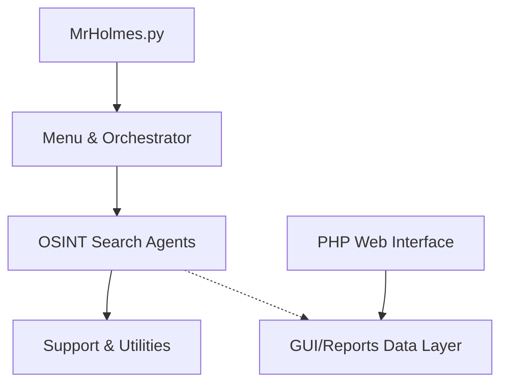

# Architecture

## High-Level Architecture

The Mr.Holmes project is separated into distinct layers, primarily driven by a core Python CLI backend generating data, and a PHP-based web frontend for analyzing that data.

## Core Components

1. **Entry Point Layer (`MrHolmes.py`)**
   - The primary dispatcher for the command-line interface. Connects the user to the interactive menu.

2. **Menu & Orchestration Agent (`Core/Support/Menu.py`)**
   - The interactive terminal loop supporting Desktop and Mobile display modes.
   - Routes user actions to specific OSINT modules based on integer selections.

3. **Core Search / Analysis Agents (`Core/Searcher*.py` and modules)**
   - **Usernames (`Core/Searcher.py`):** Uses site lists to check username availability and grab profiles.
   - **Phones (`Core/Searcher_phone.py`):** OSINT for phone numbers.
   - **Websites (`Core/Searcher_website.py`):** Domain reconnaissance.
   - **Additional Agents:** Person profiling, port scanning, email lookups, and Dork generation.

4. **Support & Utility Agents (`Core/Support/`)**
   - **Proxies:** Manages anonymization.
   - **Language:** i18n support across the CLI interface.
   - **Networking:** Standardized HTTP handling and request wrappers.

5. **Configuration & Data Layer**
   - **Configs:** `Configuration/Configuration.ini`
   - **Site Lists:** JSON logic defining URLs, error strings, and scraping tags mapped in `Site_lists/`.

6. **GUI & Reporting Layer (`GUI/`)**
   - **Reports:** Flat file and JSON storage dynamically hydrated by the Python agents (`GUI/Reports/`).
   - **Viewer:** PHP-based graphical user interface (`GUI/index.php` and modules) providing a visual alternative to reading raw terminal output.
