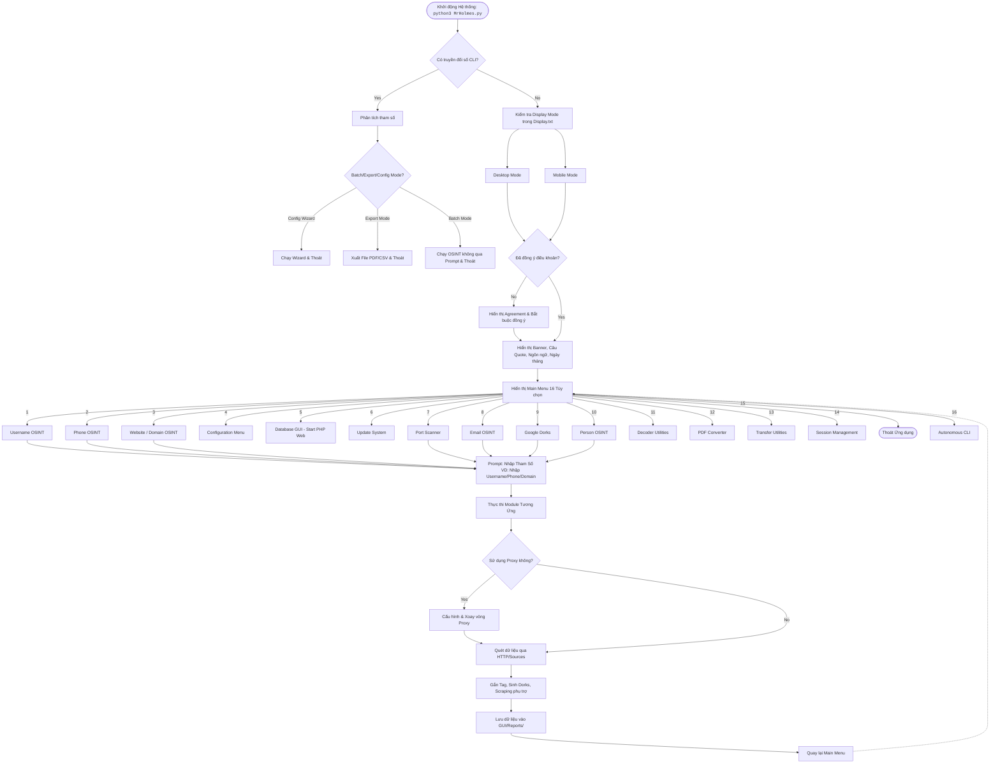

# Mr.Holmes User Flow

Tài liệu này mô tả chi tiết luồng tương tác (User Flow) của người dùng với hệ thống Mr.Holmes, từ lúc khởi động cho đến khi truy cập các tính năng cốt lõi (Mô hình CLI Interactive).

## 1. Sơ đồ Luồng chính (Main User Flow)

Sơ đồ dưới đây vẽ lại các bước thao tác của người dùng từ quá trình khởi chạy phần mềm đến Menu lựa chọn và đi sâu vào từng tính năng.

## 2. Diễn giải chi tiết các quy trình

### 2.1 Luồng Khởi Động (Entry Flow)
Khi khởi động hệ thống (`python3 MrHolmes.py`), Tool sẽ tự động phân rẽ:
- **Batch / Non-Interactive Mode**: Xảy ra khi chạy kèm cờ (VD `--investigation`, `--export`). Ứng dụng sẽ thực hiện nhiệm vụ (chạy background, xuất CSV/PDF, v.v...) rồi `Exit` mà không làm phiền người dùng với các dấu nhắc lệnh.
- **Interactive Mode**: Khởi động chay (không đối số), Mr.Holmes đọc file `Display/Display.txt` xem đang chạy trên Desktop hay Mobile (Termux) để tối ưu hiển thị Banner, kiểm tra đồng ý điều khoản, sau đó vào vòng lặp hiển thị Menu chính.

### 2.2 Luồng Các Chức Năng OSINT Đặc Biệt (Menu 1-3, 7-10)
Đa số các tuỳ chọn OSINT tình báo như Username (1), Phone (2), Domain (3), Scanner (7), E-Mail (8)... có chung một luồng hành vi (bị chi phối bởi điều hướng trong `Core/Support/Menu.py` và `Core/Searcher...`):
1. **Target Prompting**: Yêu cầu người dùng nhập input đầu vào (cưỡng chế bắt buộc không được để trống).
2. **Proxy/Network Config**: Có thể hỏi người dùng có muốn sử dụng Proxy/Tor/VPN ảo để ẩn danh.
3. **Fetching Data**: Theo mô hình OSINT pipeline, hệ thống lặp qua file danh sách mục tiêu JSON/Site lists để gửi HTTP requests.
4. **Enrichment**: Với một vài option (như Username), hệ thống có thể chạy thêm các module Scraping đặc biệt (Instagram, TikTok, Github) hoặc sinh danh sách Google/Yandex Dorks phụ trợ.
5. **Report & Recap**: Ghi lại log, lưu trữ kết quả phân tích vào các file (JSON, TXT, .mh) vào trong đường dẫn `GUI/Reports/`.

### 2.3 Luồng Các Ứng Dụng Hỗ Trợ (Menu 4-6, 11-14)
- Các công cụ không yêu cầu quét thông tin tình báo diện rộng (như Decoder - 11, Chuyển đổi PDF - 12, Quản lý Session - 14) sẽ rẽ nhánh đi vào từng Sub-menu hoặc Utility Script riêng của nó.
- **Menu 4 (Configuration):** Hệ thống tuỳ chỉnh cài đặt cá nhân, SMTP, API Keys chuyên biệt. Mở ra config sub-menu.
- **Menu 5 (Database GUI):** Mở Server PHP cục bộ, tạo localhost Web GUI để người dùng xem biểu đồ/danh sách phân tích dữ liệu OSINT một cách trực quan trên trình duyệt (thay vì đọc log text chay).
- **Menu 6 (Update):** Kích hoạt script update hệ thống (hỗ trợ riêng NT và Unix).
- **Menu 16 (Autonomous CLI):** Chế độ quét sâu tự hành, rẽ nhánh vào `ScanPipeline`.

## 3. Mức độ bao phủ yêu cầu cho E2E Tests
Với sơ đồ và diễn giải trên, khi xây dựng E2E Testing giả lập luồng thao tác CLI bằng framework (như `pytest` hoặc `pexpect`), chúng ta cần cover tối thiểu:
1. **Validation & Prompts:** Luồng tương tác nhập tham số sai/trống và xử lý vòng lặp tại `Target Prompt`.
2. **Conditionals:** Phản ứng đúng tại bước hỏi tùy chọn môi trường (Proxy: Yes/No, Update, Agree Terms).
3. **CLI Arguments:** Luồng Batch Mode/Export Mode (chạy bằng các argument `--investigation csv` nguyên khối qua terminal thay vì interactive).
4. **Resilience:** Đảm bảo luồng xử lý quay lại Menu Chính (`MainMenu`) ngay sau khi hoàn thành một tiến trình quét (không để ứng dụng crash ngang).
